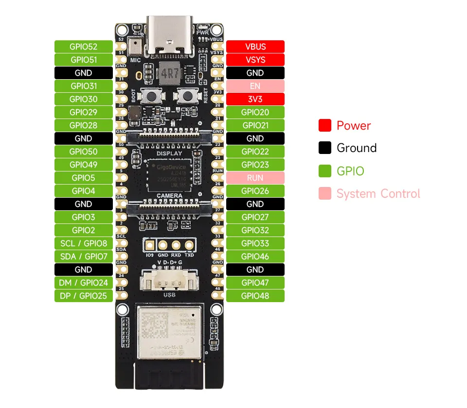

# my-esp32-board

A self-contained PlatformIO / pioarduino project template for defining a **custom ESP32 board variant** without modifying or submitting a pull request to any upstream repository.

## Why this exists

PlatformIO's Espressif Arduino build system (`pioarduino-build.py`) resolves pin definitions through a *variant* directory mechanism. The canonical path is inside the framework package:

```
~/.platformio/packages/framework-arduinoespressif32/variants/<variant>/pins_arduino.h
```

This template redirects that lookup to a local `variants/` folder inside your project, so your board definition lives entirely in your own repo.

**Source reference** — the relevant lines in the upstream build script:

```python
# espressif/arduino-esp32 · tools/pioarduino-build.py
variants_dir = join(FRAMEWORK_DIR, "variants")

if "build.variants_dir" in board_config:
    variants_dir = join("$PROJECT_DIR", board_config.get("build.variants_dir"))
```

## Repository layout

```
my-esp32-board/
├── platformio.ini                   PlatformIO project and build config
├── boards/
│   └── my_board.json                Board manifest (MCU, flash, upload, variant name)
├── variants/
│   └── my_board/
│       └── pins_arduino.h           Pin definitions — the only file you need to edit
├── src/
│   └── main.cpp                     Minimal firmware entry point
└── README.md
```

## Files explained

### `boards/my_board.json`

The board manifest consumed by PlatformIO. The two fields that make the variant redirect work:

```json
"variant":      "my_board",
"variants_dir": "variants"
```

`variants_dir` is relative to `$PROJECT_DIR`. PlatformIO merges this with any `board_build.*` overrides from `platformio.ini`.

### `platformio.ini`

```ini
board_dir             = ${PROJECT_DIR}/boards
board_build.variants_dir = variants
board_build.variant      = my_board
```

`board_dir` tells PlatformIO where to find `my_board.json`.
`board_build.variants_dir` and `board_build.variant` override the board JSON at build time (useful when you want to share one JSON across multiple environments with different pin layouts).

### `variants/my_board/pins_arduino.h`

The only file that describes your hardware. Use `static const uint8_t` for `A*` and `T*` aliases rather than `#define` — avoids ODR issues when the symbol appears in multiple translation units. See [Known gotchas](#known-gotchas) for other rules derived from real build failures.

## Customising for your board

1. **Rename** every occurrence of `my_board` (directory names, JSON fields, `platformio.ini` values) to your board's identifier. Use only lowercase letters, digits, and underscores — no hyphens.
1. **Edit `variants/my_board/pins_arduino.h`** — set the correct GPIO numbers for your schematic:

   - `LED_BUILTIN`
   - SPI (`PIN_SPI_SS`, `PIN_SPI_MOSI`, `PIN_SPI_MISO`, `PIN_SPI_SCK`)
   - I²C (`PIN_WIRE_SDA`, `PIN_WIRE_SCL`)
   - UART (`PIN_SERIAL_RX`, `PIN_SERIAL_TX`)
   - ADC aliases (`A0`–`A19`) — remove any that don't exist on your board
   - Touch aliases (`T0`–`T9`) — remove any that don't exist on your board
   - Note: ADC2 pins are unavailable while Wi-Fi is active
1. **Edit `boards/my_board.json`** — set:

   - `"mcu"` — e.g. `esp32`, `esp32s3`, `esp32c3`
   - `"f_cpu"` — CPU frequency in Hz as a string (`"240000000L"`)
   - `"flash_size"`, `"maximum_size"`, `"maximum_ram_size"` — match your module
   - `"upload.speed"` — baud rate for flashing
1. **Build and verify:**

```sh
pio run -v
```

The verbose flag shows the exact `-I` paths the compiler uses. Confirm your `variants/my_board/` folder appears *before* the framework's own `variants/` folder in the include search order.

5. **Sanity-check at runtime** — `main.cpp` prints the resolved variant name on boot:

```cpp
Serial.printf("Variant: %s\n", ARDUINO_VARIANT);
// Should print: Variant: my_board
```

## Platform

Uses [pioarduino](https://github.com/pioarduino/platform-espressif32) — a community-maintained fork of the Espressif PlatformIO platform with current Arduino 3.x / ESP-IDF 5.x support.

```ini
platform = https://github.com/pioarduino/platform-espressif32/releases/download/stable/platform-espressif32.zip
```

Pin to a specific release tag instead of `stable` for reproducible builds.

## Worked example — creating a variant from a pinout image

Vendors typically publish a board photo with GPIO labels along each header edge. The repo's `variants/esp32_p4_wifi6/` was generated this way from a Waveshare ESP32-P4-WIFI6 pinout:



Source: [Waveshare ESP32-P4-WIFI6 — Pinout definition](https://docs.waveshare.com/ESP32-P4-WIFI6#pinout-definition).

### Procedure

1. **Read the image edge-by-edge.** Walk one column at a time, top to bottom, capturing every label verbatim — GPIO numbers, power rails (`3V3`, `VBUS`, `VSYS`), grounds, control pins (`EN`, `RUN`, `BOOT`), and any silkscreened bus names (`SDA / GPIO7`, `DM / GPIO24`). Don't normalise yet; literal first.

2. **Identify the SoC** from the module silkscreen. The MCU choice fixes `mcu` / `f_cpu` / `ldscript` / openocd target in the board JSON, and gates which pin-count / ADC / touch macros the framework exposes. ESP32-P4 implies `esp32p4`, `360000000L`, `esp32p4_out.ld`, `esp32p4.cfg`.

3. **Pick a variant id** matching `[a-z0-9_]+`. Hyphens break the `ARDUINO_<NAME>` define generated from `extra_flags`. Pretty display name lives in the JSON `name` field.

4. **Map silkscreen labels to standard Arduino macros** in `pins_arduino.h`:

   | Silkscreen | Macro |
   | --- | --- |
   | `SDA / GPIO7`, `SCL / GPIO8` | `PIN_WIRE_SDA`, `PIN_WIRE_SCL` |
   | `DM / GPIO24`, `DP / GPIO25` | `PIN_USB_DM`, `PIN_USB_DP` |
   | RX / TX (if dedicated header pins) | `PIN_SERIAL_RX`, `PIN_SERIAL_TX` |
   | MOSI / MISO / SCK / SS (if labeled) | `PIN_SPI_MOSI` etc. |
   | "LED" silkscreen near an indicator | `LED_BUILTIN` |

   Pins that are *only* present on the SoC but not broken out to the header should be left undefined — they cannot be used externally, so aliasing them misleads users.

5. **Assign `A*` / `T*` aliases** by cross-referencing each header GPIO against the SoC's ADC and touch channel maps (TRM or `soc_caps.h`). Use `static const uint8_t`, not `#define`. Drop aliases for channels not exposed on the header. The P4 has no touch peripheral — no `T*` aliases.

6. **Add SoC-specific obligations.** The framework's HAL code may reference variant-defined macros that have nothing to do with the visible pinout:
   - ESP32-P4: `BOARD_SDMMC_POWER_CHANNEL` must be defined (canonical value `4`) even if SDMMC is unused, because `esp32-hal-spi.c::setLDOPower()` references it under `#ifdef SOC_SDMMC_IO_POWER_EXTERNAL`.
   - ESP32-S3 boards with PSRAM: confirm `extra_flags` includes `-DBOARD_HAS_PSRAM` if applicable.

7. **Write `boards/<id>.json` and add the env** to `platformio.ini`. Build with `pio run -v -e <id>` and confirm the project's `variants/<id>/` appears in the `-I` order before the framework's `variants/`.

8. **Runtime verification.** Flash, open monitor, confirm `Serial.printf("Variant: %s\n", ARDUINO_VARIANT)` prints your id. Anything else means the redirect did not take effect.

## Known gotchas

| Symptom | Cause | Fix |
| --- | --- | --- |
| `"NUM_DIGITAL_PINS" redefined` warning on every TU | Defined in `pins_arduino.h` | Remove the define; `Arduino.h` sets it after including this header, via `SOC_GPIO_PIN_COUNT` / `SOC_ADC_CHANNEL_NUM()` |
| `unknown type name 'uint8_t'` in `.c` files | Missing `<stdint.h>` — header is pulled into C TUs like `esp32-hal-gpio.c` | Add `#include <stdint.h>` at top of header |
| Wrong variant loaded (`ARDUINO_VARIANT` prints `esp32`) | `board_build.variants_dir` path wrong or missing | Check path is relative to `$PROJECT_DIR`, not absolute |
| Build uses upstream pins instead of yours | `board_build.variant` name doesn't match folder name | They must be identical, case-sensitive |
| `BOARD_SDMMC_POWER_CHANNEL undeclared` building `esp32-hal-spi.c` (P4 only) | Variant header missing the macro; `setLDOPower()` references it under `#ifdef SOC_SDMMC_IO_POWER_EXTERNAL` | `#define BOARD_SDMMC_POWER_CHANNEL 4` in `pins_arduino.h` (matches all stock P4 variants) |

## Claude Code skill

The conventions, gotchas, and full minimal template captured here are also packaged as a Claude Code skill so future sessions get them automatically:

- Repo-local copy: [`.claude/skills/pioarduino/`](.claude/skills/pioarduino/) — committed alongside this project, so it travels with the repo.
- User-global copy: `~/.claude/skills/pioarduino/` — active across every project.

`SKILL.md` mirrors the build-command reference and the variant-redirect mechanism; `references/custom-variant-template.md` is the full file-by-file template. Skill is an early sketch — edit it as new gotchas surface (the P4 SDMMC LDO row above arrived this way).
